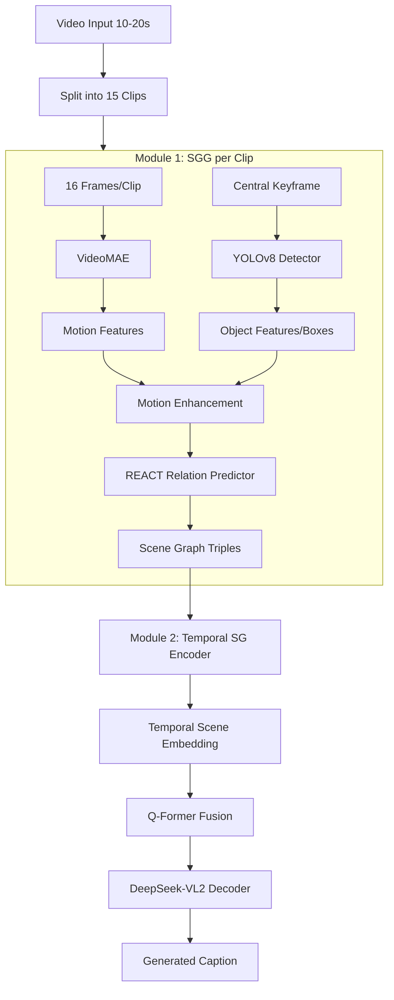

# SGG-ClassCap: Temporal Scene Graph Generation for Classroom Video Captioning

## 1. Tổng Quan & Động Lực
Tài liệu này đề xuất kiến trúc **SGG-ClassCap**, một bản nâng cấp của Q-ClassCap nhằm giải quyết các hạn chế về biểu diễn quan hệ và chi phí tính toán.

### 1.1 Vấn đề của kiến trúc cũ (Q-ClassCap)
*   **Object Head**: Learnable queries hoạt động "mù", thiếu cấu trúc quan hệ rõ ràng.
*   **Action Head**: Attention đơn giản, không nắm bắt được ngữ cảnh phức tạp giữa hành động và đối tượng.
*   **Global Head**: Thiếu mô hình hóa quan hệ không gian.

### 1.2 Giải pháp SGG-ClassCap
Tích hợp **Scene Graph Generation (SGG)** sử dụng mô hình **REACT** từ SGG-Benchmark:
1.  **Cấu trúc hóa**: Chuyển features thô thành các bộ ba `(subject, predicate, object)` rõ nghĩa.
2.  **Thông tin ngữ nghĩa**: Scene graph cung cấp biểu diễn symbolic dễ giải thích.
3.  **Hiệu năng**: REACT (23ms/ảnh) nhanh và nhẹ hơn architecture cũ.

---

## 2. Kiến Trúc Đề Xuất

### Pipeline Tổng Quat

### Module 1: SGG cho từng Clip (Tích hợp Motion)
Sử dụng mô hình **REACT** nhưng được cường hóa bằng thông tin chuyển động.

*   **Input**: Keyframe (Spatial) + VideoMAE features (Temporal/Motion).
*   **Object Detection**: Sử dụng **YOLOv8** (hoặc YOLO-World cho open-vocabulary) để detect: `student`, `phone`, `laptop`, `chair`...
*   **Motion Enhancement (New)**: Tích hợp context động vào object features trước khi đưa vào relation predictor.
    *   *Idea*: Object features + Motion inside box + Motion around box.
*   **Relation Prediction**: REACT dự đoán các quan hệ: `(student, using, phone)`, `(student, sitting, chair)`.

### Module 2: Temporal Scene Graph Encoder (Đóng góp chính)
Tổng hợp 15 scene graphs rời rạc thành một biểu diễn video thống nhất.

*   **Step 1: Graph Embedding**:
    *   Node Embedding: Visual Feat + Class Embed + Position Encoding.
    *   Edge Embedding: Subject Node + Predicate Embed + Object Node.
    *   *Graph Pooling*: Tổng hợp toàn bộ graph thành 1 vector (hoặc giữ nguyên sequence of nodes).
*   **Step 2: Temporal Attention**:
    *   Sử dụng Transformer Encoder để học mối quan hệ giữa các clips (trends, changes).
*   **Step 3: Change Detection (Bonus)**:
    *   Phát hiện sự thay đổi tập hợp predicates giữa các frames liên tiếp để nhận diện hành vi thay đổi (e.g., đang *focusing* chuyển sang *using phone*).

### Module 3: Fusion & Decoding
*   **Q-Former**: Nhận đầu vào là `temporal_scene_embedding` (giàu ngữ nghĩa) thay vì các raw features rời rạc của 3 heads cũ.
*   **DeepSeek-VL2**: Sinh caption từ visual prompts của Q-Former.

---

## 3. Chiến Lược Huấn Luyện (Training Strategy)

### Phase 1: Pretrain/Prepare SGG (Frozen)
*   Sử dụng pretrained **REACT** (train trên Visual Genome).
*   *Challenge*: Visual Genome thiếu các objects lớp học?
*   *Solution*: Sử dụng **YOLO-World** (Open Vocabulary) để detect `student`, `projector`, `whiteboard` mà không cần training lại detector.

### Phase 2: Train Temporal Encoder + Captioning
*   Đóng băng (Freeze) toàn bộ module SGG (YOLO + REACT).
*   Chỉ huấn luyện:
    1.  **Temporal Scene Graph Encoder**.
    2.  **Q-Former** (Fine-tune).
    3.  **DeepSeek-VL2** (LoRA hoặc Fine-tune nhẹ).
*   **Loss Function**:
    *   `L_caption`: Cross-Entropy standard.
    *   `L_temporal`: Consistency loss (nếu có ground truth behavior sequences).

---

## 4. Kế Hoạch Thực Nghiệm & Đánh Giá

### Metrics
*   **Captioning**: BLEU-4, CIDEr, METEOR, ROUGE-L.
*   **SGG**: Recall@K (R@K), Informative Recall@K (IR@K).
*   **Speed**: Inference time (ms/video).

### Ablation Studies
1.  **Effect of SGG**: So sánh SGG-ClassCap vs Original Q-ClassCap.
2.  **Effect of Motion Integration**: SGG tĩnh (chỉ Keyframe) vs SGG động (+VideoMAE).
3.  **Effect of Temporal Encoder**: Simple Pooling vs Transformer Encoder.

### Novelty Claims
1.  **Scene Graph cho Classroom**: Ứng dụng đầu tiên của SGG cho giám sát lớp học.
2.  **Temporal SGG**: Đề xuất module mã hóa SGG theo thời gian.
3.  **Motion-Aware SGG**: Cải tiến REACT để sử dụng video features.
